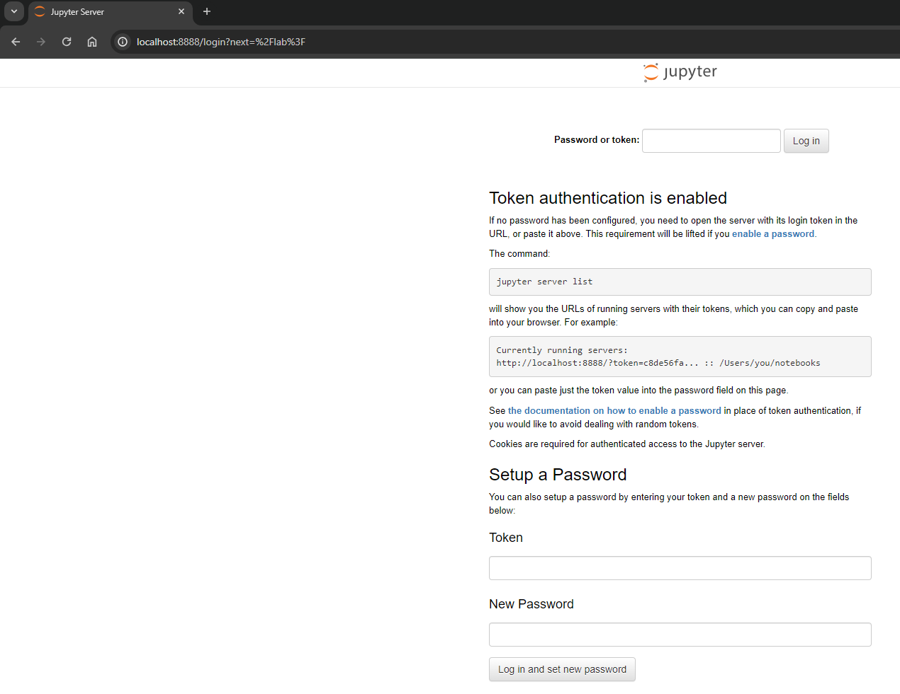
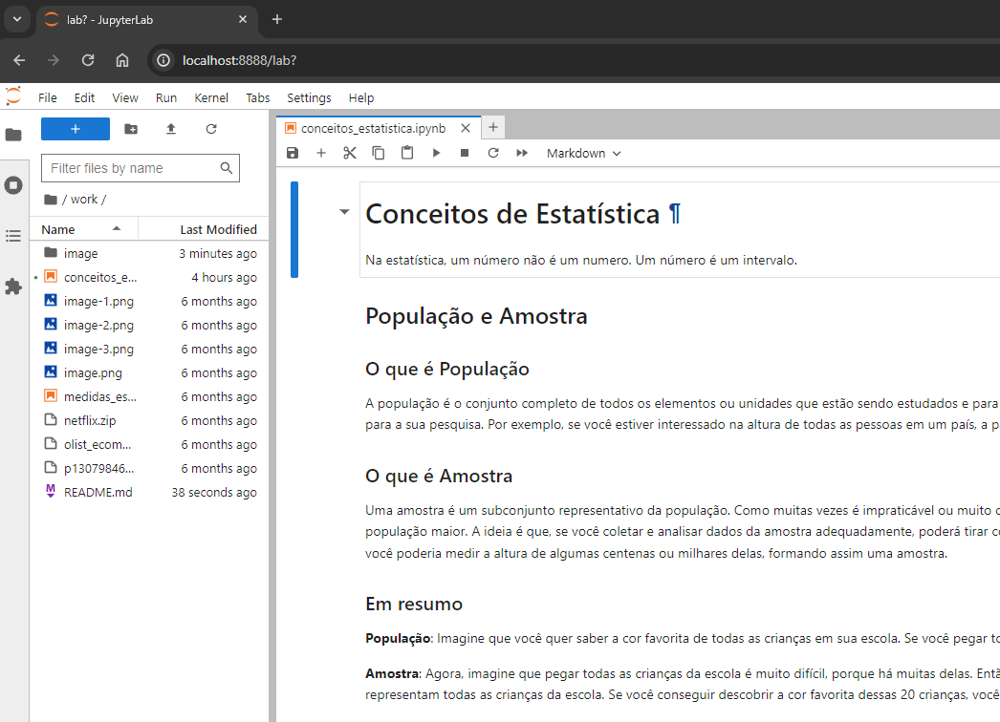

# Curso de Estatística

## Objetivo

O objetivo deste conteúdo é praticar o que estou aprendendo no curso [Intensivo Data Analytics](https://asn.rocks/ida/), da Adriana Silva, da ASN.ROCKS. A idéia e ter um entendimento do conteúdo e colocar minhas analogias a respeito dos temas, além de buscar outras referências para os conteúdos aprendidos.

## Ferramentas

Com a idéia de ter uma imersão no mundo de dados, vou utilizar de ferramentas de mercado, para sempre procurar trazer um toque do mundo real. Segue abaixo algumas ferramentas:

### Git

Já inicio a utilização da ferramenta para expor o conteúdo do curso. Hoje no mundo da tecnologia saber sobre Git é requisito obrigatório.

### Python

É uma linguagem muito utilizada no mundo de dados. Vou utilizá-la para demonstrar os cálculos ao longo do curso.

### Docker Desktop

A idéia de utilizar Docker é para já ter uma imersão em soluções containerizadas, como Kubernetes, por exemplo. Com isto já acostumamos com este processo e a utilização em qualquer Cloud Provider se torna mais fácil.

### Jupyter

Com Jupyter fica fácil a mistura de conceito, mais código Python, além de ser uma ferramenta de mercado bastante utilizada.

## Instalação das ferramentas

**1. Instalando Docker**

- Fazer o download do [Docker Desktop](https://desktop.docker.com/win/main/amd64/145265/Docker%20Desktop%20Installer.exe).
- Clique duas vezes Docker Desktop Installer.exe para executar o instalador. Por padrão, o Docker Desktop é instalado em C:\Program Files\Docker\Docker.
- Quando solicitado, certifique-se de que a opção Usar WSL 2 em vez de Hyper-V na página Configuração esteja selecionada ou não, dependendo de sua escolha de back-end.
- Se o seu sistema suportar apenas uma das duas opções, você não poderá selecionar qual back-end usar.
- Siga as instruções do assistente de instalação para autorizar o instalador e prosseguir com a instalação.
- Quando a instalação for bem-sucedida, selecione Fechar para concluir o processo de instalação.

Se sua conta de administrador for diferente de sua conta de usuário, você deverá adicionar o usuário ao grupo docker-users :

- Execute o Gerenciamento do Computador como administrador .
- Navegue até Usuários e grupos locais > Grupos > docker-users .
- Clique com o botão direito para adicionar o usuário ao grupo.
- Saia e faça login novamente para que as alterações entrem em vigor.


2. Executando o Jupyter Notebook dockerizado
- Abrir o PowerShell no seu Windows
- Navegar via prompt até o diretório onde estão seus arquivos Jupyter (*.ipynb), se já existirem. Exemplo:
```powershell
cd C:\Users\harol\vmshared\git\curso_estatistica
```
- Executar o comando:
```powershell
docker run -d --name meu-jupyter -p 8888:8888 -v "${PWD}:/home/jovyan/work" -e JUPYTER_TOKEN='meutoken123' jupyter/base-notebook
```

Com isto, você consegue acessar no seu browser de preferência o Jupyter Notebook: http://localhost:8888/



O token para acesso é "meutoken123". Por ser um ambiente de estudo e não produtivo, pode se utilizar, mas o token está aberto e é de responsabilidade de quem executar o código se utiliza ou alterra esta informação.

- Após login, o Jupyter carregada o que está no diretório que foi executado o comando:


## Referências

- [Docker Desktop release notes](https://docs.docker.com/desktop/release-notes/)
